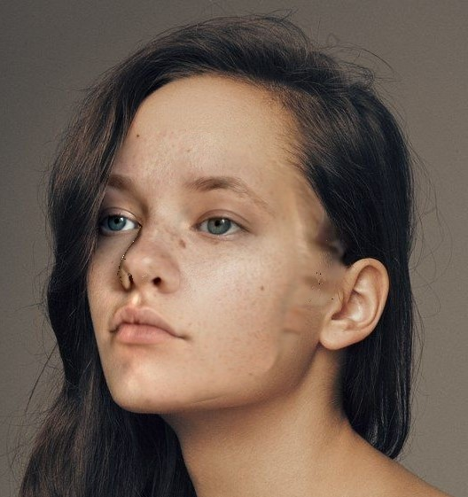
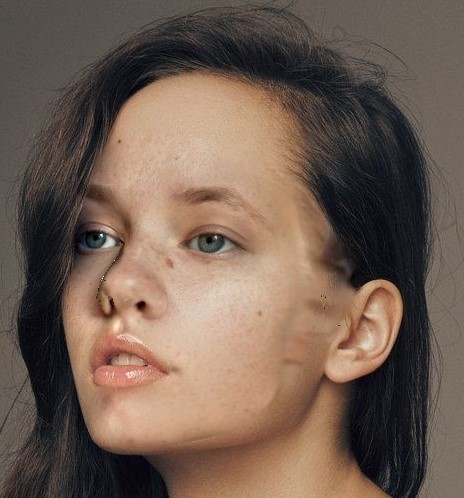

# Facial-Replacement
Homography based facial replacement using segmentation. This library focuses on utilizing segmentation to create a more pose invariant facial replacement method when using homography.

The basis of this library is made off of reference [2] for dense facial landmark collection.

This is a project for CS 8650, and was turned into a small informal paper.

# Full Process

# Dense Landmark Collection [2]

# Facial Segmentation Using Landmarks

# Projection of Face and Facial Replacement

 

# References

[1] G. Bradski. The OpenCV Library. Dr. Dobb’s Journal of Software Tools, 2000. 

[2] Yao Feng, Fan Wu, Xiaohu Shao, Yanfeng Wang, and Xi Zhou. Joint 3d face reconstruction and dense alignment with position map regression network. In ECCV, 2018. 

[3] Adam Geitgey. Facial recognition. https://github.com/ ageitgey/face_recognition/blob/master/LICENSE, 2017. MIT License. 

[4] Eric Jones, Travis Oliphant, Pearu Peterson, et al. SciPy: Open source scientific tools for Python. http://www.scipy.org/, 2001.

[5] Travis Oliphant. NumPy: A guide to NumPy. http://www. numpy.org/, 2006. USA: Trelgol Publishing. 

[6] wuhuikai, XiangFugui, and niczem. Faceswap. https://github. com/wuhuikai/FaceSwap, 2018. 
